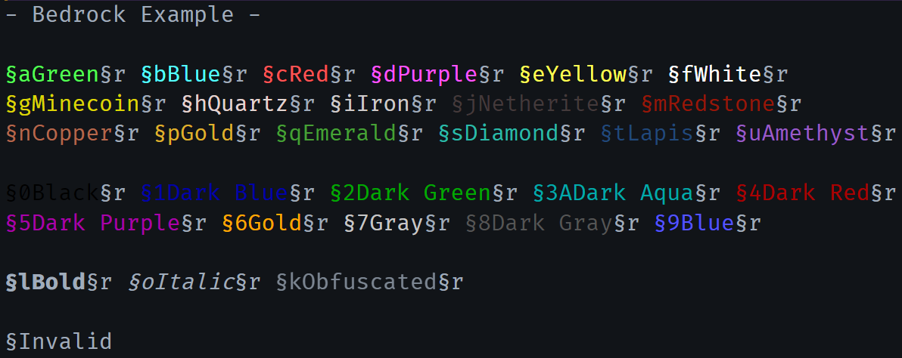
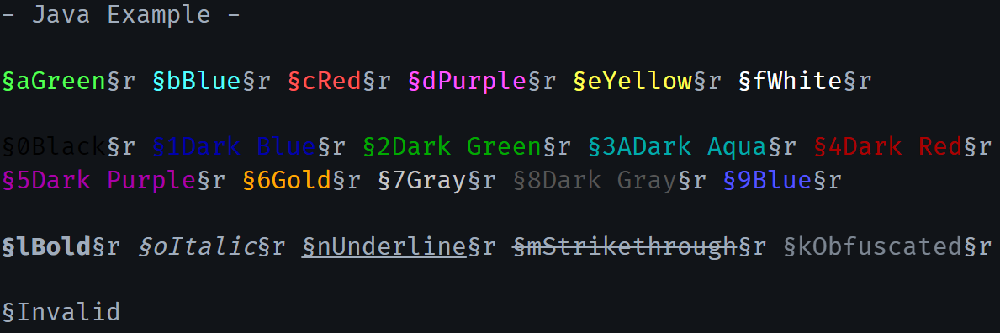

# Minecraft Colorer

`mc-color` is an extension that will format Minecraft color escape characters (§) in the editor.




## Pre Version 2.0.0 Users

This extension recently updated adding explicit support for Java and Bedrock. **By default it will be configured for Bedrock.** You will likely need to update your settings Java peeps.

## Configuration

The default configuration is:

```jsonc
{
  // Whether the extension is enabled or not.
  "mc-color.enabled": true,

  // Marker type provides a few means of highlighting text.
  "mc-color.markerType": "foreground",

  // Specfic languages to highlight on.
  // You can also do "!language" to not tokenize just that language.
  "mc-color.languages": ["*"],

  // Tells the tokenization proccess to stop on \n before 3/3/2023 it would not do this
  // Feel free to disable it if you preferred how it was before
  "mc-color.newLineDelimiter": true,

  // Delimiters are characters that are used to STOP tokenization.
  // When the tokenizer hits these character it will not color any further
  // no matter what.
  "mc-color.delimiters": ["`"],

  // Prefixes are characters that will start tokenization. (§) is the
  // default Minecraft token and (&) is used for many server tools.
  "mc-color.prefixes": ["§", "&"],

  // Swaps between Java and Bedrock since they are very different now.
  // Valid values are 'bedrock', 'java'.
  "mc-color.mode": "bedrock",

  // Replicates a Java edition bug where text decoration formats don't
  // carry over to the next color prefix.
  "mc-color.replicateJavaBug": false
}
```

You can edit these settings by navigating to vscode settings: `⚙ -> settings` and searching `mc-color` in the search bar at the top!
